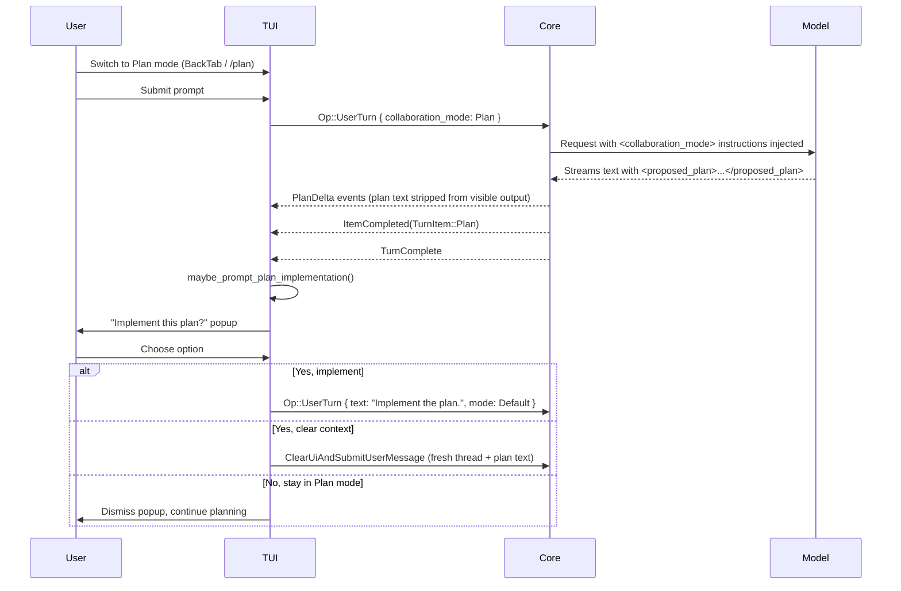

rework plan mode

---

https://deepwiki.com/search/how-does-codex-plan-mode-works_a4558fb8-b606-41db-bf17-4ddd0835f4b0?mode=deep

# DeepWiki Q&A with Code Context for Repository: openai/codex
## Q1
How does codex plan mode works? Including permission and hand off to user review and edit, approve.
### Answer
The user wants to understand how Codex's "plan mode" works, including permissions, handoff to user review/edit, and approval. Let me search for relevant code in the openai/codex repository.

Let me gather more detailed information about plan mode by reading the key files identified in the search results.

Let me gather more information about the plan mode flow, particularly around:
1. How the `<proposed_plan>` block is parsed and emitted
2. How the turn is structured in plan mode (what instructions are injected)
3. The approval/handoff flow after the plan is shown
4. The `request_user_input` mechanism in plan mode
5. The `disabled_plan_turn` function referenced in tests

Let me read more files in parallel.

Let me gather more information about the plan mode flow, specifically:
1. How the turn is structured in plan mode (what instructions are injected, the `request_user_input` mechanism)
2. The `turn_runtime.rs` file which handles plan item completion and the popup
3. The `protocol.rs` file in chatwidget which handles plan events
4. The `stream_events_utils.rs` for plan mode handling
5. The `ProposedPlanParser` in stream-parser

Let me read these files in parallel.

I now have enough information to provide a comprehensive answer about how plan mode works in Codex. Let me synthesize what I've found:

1. **ModeKind::Plan** - The plan mode is one of two TUI-visible collaboration modes (the other being `Default`).

2. **How plan mode is activated**:
   - User selects it via the TUI (BackTab cycles modes, or `/plan` slash command)
   - It's attached to each `Op::UserTurn` submission as `collaboration_mode: Some(CollaborationMode { mode: ModeKind::Plan, ... })`
   - The mode can have custom `developer_instructions` injected into the model context as XML-wrapped `<collaboration_mode>...</collaboration_mode>` tags

3. **What happens during a plan turn**:
   - The model is instructed to produce a `<proposed_plan>` block in its response
   - The `AssistantTextStreamParser` (with `plan_mode: true`) strips `<proposed_plan>...</proposed_plan>` blocks from visible text and emits them as `ProposedPlanSegment` events
   - These segments are streamed as `PlanDelta` events to the TUI
   - The plan text is stored as `latest_proposed_plan_markdown` in the transcript
   - The completed plan is emitted as a `TurnItem::Plan` item

4. **Permissions in plan mode**:
   - `ModeKind::Plan.allows_request_user_input()` returns `true` (only plan mode allows this)
   - Automatic idle work (extension-initiated turns) is **blocked** in plan mode (`try_start_turn_if_idle` returns `TryStartTurnIfIdleRejectionReason::PlanMode`)
   - The model does NOT execute tools (shell commands, file changes) in plan mode - it only plans

5. **Handoff to user review/approve**:
   - When the turn completes (`on_task_complete`), `maybe_prompt_plan_implementation()` is called
   - This checks: collaboration modes enabled, no queued messages, active mode is Plan, `saw_plan_item_this_turn` is true, no modal/popup active
   - If all conditions met, `open_plan_implementation_prompt()` is called
   - This shows a `SelectionViewParams` popup with three options:
     1. **"Yes, implement this plan"** - switches to Default mode and sends "Implement the plan." as a user message
     2. **"Yes, clear context and implement"** - clears the thread and starts fresh with the plan text prepended with a context prefix
     3. **"No, stay in Plan mode"** - dismisses the popup and continues planning

6. **The approval popup**:
   - Title: "Implement this plan?"
   - Option 1 sends `AppEvent::SubmitUserMessageWithMode { text: "Implement the plan.", collaboration_mode: default_mask }`
   - Option 2 sends `AppEvent::ClearUiAndSubmitUserMessage { text: "<prefix>\n\n<plan_markdown>" }`
   - A `Notification::PlanModePrompt` is also sent for desktop notifications

7. **Collaboration instructions**:
   - When `collaboration_mode` is set, the `developer_instructions` are injected into the model context as `<collaboration_mode>...</collaboration_mode>` XML tags
   - These are injected as developer messages on each turn
   - When the mode changes, a new instruction message is appended to the conversation history

Let me now write a clear, well-structured answer.


Here is a detailed breakdown of how plan mode works end-to-end.

---

## Plan Mode Overview

Plan mode is one of two TUI-visible collaboration modes (`Plan` and `Default`). Its purpose is to have the model produce a structured plan **without executing any tools**, then hand off to the user for review before implementation begins.

---

## 1. Mode Definition & Activation

`ModeKind::Plan` is defined in `codex-rs/protocol/src/config_types.rs`: codex:605-650

Key properties:
- `allows_request_user_input()` returns `true` **only** for `Plan` mode — this is the mechanism that lets the model pause and ask the user a question mid-turn.
- `is_tui_visible()` is `true` for both `Plan` and `Default`.

The user activates it by pressing `BackTab` to cycle modes, typing `/plan`, or selecting it from the mode picker. The active mode is attached to every `Op::UserTurn` submission as a `CollaborationMode` struct.

---

## 2. What Happens During a Plan Turn

### Collaboration instructions injected into the model

When `collaboration_mode` is set, `developer_instructions` are injected into the model context as XML-wrapped developer messages:

```
<collaboration_mode>...instructions...</collaboration_mode>
```

These are added on each turn and deduplicated — a new message is only appended when the instructions change. codex:53-55

### The `<proposed_plan>` block

The model is instructed to wrap its plan in a `<proposed_plan>...</proposed_plan>` XML block. The `AssistantTextStreamParser` (in `plan_mode: true` mode) strips this block from the visible text and emits it as `ProposedPlanSegment` events: codex:20-72

These segments are forwarded to the TUI as `PlanDelta` streaming events and stored as `latest_proposed_plan_markdown` in the transcript. The completed plan is emitted as a `TurnItem::Plan` item. codex:461-523

### No tool execution / no idle work

In plan mode, the session **blocks all extension-initiated idle turns**: codex:57-63

The model is not given shell/file-change tools in plan mode — it only produces text output.

---

## 3. Handoff to User Review

When the agent turn completes, `on_task_complete` calls `maybe_prompt_plan_implementation()`: codex:222-247

This fires only when:
- Collaboration modes are enabled
- Active mode is `Plan`
- A plan item was seen this turn (`saw_plan_item_this_turn`)
- No queued follow-up messages exist
- No modal/popup is already active

---

## 4. The Approval Popup

`open_plan_implementation_prompt()` shows a `SelectionViewParams` popup: codex:249-262

The popup (rendered snapshot):

```
  Implement this plan?

› 1. Yes, implement this plan          Switch to Default and start coding.
  2. Yes, clear context and implement  Fresh thread with this plan.
  3. No, stay in Plan mode             Continue planning with the model.

  Press enter to confirm or esc to go back
``` codex:1-11

The three choices are wired in `plan_implementation.rs`: codex:9-113

| Choice | Action |
|---|---|
| **Yes, implement this plan** | Sends `AppEvent::SubmitUserMessageWithMode { text: "Implement the plan.", collaboration_mode: default_mask }` — switches to Default mode in the same thread |
| **Yes, clear context and implement** | Sends `AppEvent::ClearUiAndSubmitUserMessage` with the plan text prefixed by a context-reset prompt, starting a fresh thread |
| **No, stay in Plan mode** | Dismisses the popup; user can continue refining the plan |

The "clear context" option prepends: codex:14-19

---

## 5. Notifications

A `Notification::PlanModePrompt` is fired when the popup opens, which is distinct from `approval-requested` notifications and uses the type name `"plan-mode-prompt"` for filtering: codex:569-585

---

## Summary Flow


### Citations
**File:** codex-rs/protocol/src/config_types.rs (L605-650)
```rust
/// Initial collaboration mode to use when the TUI starts.
#[derive(
    Clone, Copy, Debug, Serialize, Deserialize, PartialEq, Eq, Hash, JsonSchema, TS, Default,
)]
#[serde(rename_all = "snake_case")]
pub enum ModeKind {
    Plan,
    #[default]
    #[serde(
        alias = "code",
        alias = "pair_programming",
        alias = "execute",
        alias = "custom"
    )]
    Default,
    #[doc(hidden)]
    #[serde(skip_serializing, skip_deserializing)]
    #[schemars(skip)]
    #[ts(skip)]
    PairProgramming,
    #[doc(hidden)]
    #[serde(skip_serializing, skip_deserializing)]
    #[schemars(skip)]
    #[ts(skip)]
    Execute,
}

pub const TUI_VISIBLE_COLLABORATION_MODES: [ModeKind; 2] = [ModeKind::Default, ModeKind::Plan];

impl ModeKind {
    pub const fn display_name(self) -> &'static str {
        match self {
            Self::Plan => "Plan",
            Self::Default => "Default",
            Self::PairProgramming => "Pair Programming",
            Self::Execute => "Execute",
        }
    }

    pub const fn is_tui_visible(self) -> bool {
        matches!(self, Self::Plan | Self::Default)
    }

    pub const fn allows_request_user_input(self) -> bool {
        matches!(self, Self::Plan)
    }
```
**File:** codex-rs/core/tests/suite/collaboration_instructions.rs (L53-55)
```rust
fn collab_xml(text: &str) -> String {
    format!("{COLLABORATION_MODE_OPEN_TAG}{text}{COLLABORATION_MODE_CLOSE_TAG}")
}
```
**File:** codex-rs/utils/stream-parser/src/assistant_text.rs (L20-72)
```rust
/// Parses assistant text streaming markup in one pass:
/// - strips `<oai-mem-citation>` tags and extracts citation payloads
/// - in plan mode, also strips `<proposed_plan>` blocks and emits plan segments
#[derive(Debug, Default)]
pub struct AssistantTextStreamParser {
    plan_mode: bool,
    citations: CitationStreamParser,
    plan: ProposedPlanParser,
}

impl AssistantTextStreamParser {
    pub fn new(plan_mode: bool) -> Self {
        Self {
            plan_mode,
            ..Self::default()
        }
    }

    pub fn push_str(&mut self, chunk: &str) -> AssistantTextChunk {
        let citation_chunk = self.citations.push_str(chunk);
        let mut out = self.parse_visible_text(citation_chunk.visible_text);
        out.citations = citation_chunk.extracted;
        out
    }

    pub fn finish(&mut self) -> AssistantTextChunk {
        let citation_chunk = self.citations.finish();
        let mut out = self.parse_visible_text(citation_chunk.visible_text);
        if self.plan_mode {
            let mut tail = self.plan.finish();
            if !tail.is_empty() {
                out.visible_text.push_str(&tail.visible_text);
                out.plan_segments.append(&mut tail.extracted);
            }
        }
        out.citations = citation_chunk.extracted;
        out
    }

    fn parse_visible_text(&mut self, visible_text: String) -> AssistantTextChunk {
        if !self.plan_mode {
            return AssistantTextChunk {
                visible_text,
                ..AssistantTextChunk::default()
            };
        }
        let plan_chunk: StreamTextChunk<ProposedPlanSegment> = self.plan.push_str(&visible_text);
        AssistantTextChunk {
            visible_text: plan_chunk.visible_text,
            plan_segments: plan_chunk.extracted,
            ..AssistantTextChunk::default()
        }
    }
```
**File:** codex-rs/core/tests/suite/items.rs (L461-523)
```rust
#[tokio::test(flavor = "multi_thread", worker_threads = 2)]
async fn plan_mode_emits_plan_item_from_proposed_plan_block() -> anyhow::Result<()> {
    skip_if_no_network!(Ok(()));

    let server = start_mock_server().await;

    let TestCodex {
        codex,
        session_configured,
        ..
    } = test_codex().build(&server).await?;

    let plan_block = "<proposed_plan>\n- Step 1\n- Step 2\n</proposed_plan>\n";
    let full_message = format!("Intro\n{plan_block}Outro");
    let stream = sse(vec![
        ev_response_created("resp-1"),
        ev_message_item_added("msg-1", ""),
        ev_output_text_delta(&full_message),
        ev_assistant_message("msg-1", &full_message),
        ev_completed("resp-1"),
    ]);
    mount_sse_once(&server, stream).await;

    let collaboration_mode = CollaborationMode {
        mode: ModeKind::Plan,
        settings: Settings {
            model: session_configured.model.clone(),
            reasoning_effort: None,
            developer_instructions: None,
        },
    };

    codex
        .submit(disabled_plan_turn(
            "please plan",
            session_configured.model.clone(),
            collaboration_mode,
        )?)
        .await?;

    let plan_delta = wait_for_event_match(&codex, |ev| match ev {
        EventMsg::PlanDelta(event) => Some(event.clone()),
        _ => None,
    })
    .await;

    let plan_completed = wait_for_event_match(&codex, |ev| match ev {
        EventMsg::ItemCompleted(ItemCompletedEvent {
            item: TurnItem::Plan(item),
            ..
        }) => Some(item.clone()),
        _ => None,
    })
    .await;

    assert_eq!(
        plan_delta.thread_id,
        session_configured.thread_id.to_string()
    );
    assert_eq!(plan_delta.delta, "- Step 1\n- Step 2\n");
    assert_eq!(plan_completed.text, "- Step 1\n- Step 2\n");

    Ok(())
```
**File:** codex-rs/core/src/session/inject.rs (L57-63)
```rust
        }
        if self.collaboration_mode().await.mode == ModeKind::Plan {
            return Err(TryStartTurnIfIdleError::new(
                TryStartTurnIfIdleRejectionReason::PlanMode,
                input,
            ));
        }
```
**File:** codex-rs/tui/src/chatwidget/turn_runtime.rs (L222-247)
```rust
    pub(super) fn maybe_prompt_plan_implementation(&mut self) {
        if !self.collaboration_modes_enabled() {
            return;
        }
        if self.has_queued_follow_up_messages() {
            return;
        }
        if self.active_mode_kind() != ModeKind::Plan {
            return;
        }
        if !self.transcript.saw_plan_item_this_turn {
            return;
        }
        if !self.bottom_pane.no_modal_or_popup_active() {
            return;
        }

        if matches!(
            self.rate_limit_switch_prompt,
            RateLimitSwitchPromptState::Pending
        ) {
            return;
        }

        self.open_plan_implementation_prompt();
    }
```
**File:** codex-rs/tui/src/chatwidget/turn_runtime.rs (L249-262)
```rust
    pub(super) fn open_plan_implementation_prompt(&mut self) {
        let default_mask = collaboration_modes::default_mode_mask(self.model_catalog.as_ref());
        let context_usage_label = self.plan_implementation_context_usage_label();

        self.bottom_pane
            .show_selection_view(plan_implementation::selection_view_params(
                default_mask,
                self.transcript.latest_proposed_plan_markdown.as_deref(),
                context_usage_label.as_deref(),
            ));
        self.notify(Notification::PlanModePrompt {
            title: PLAN_IMPLEMENTATION_TITLE.to_string(),
        });
    }
```
**File:** codex-rs/tui/src/chatwidget/snapshots/codex_tui__chatwidget__tests__plan_implementation_popup.snap (L1-11)
```text
---
source: tui/src/chatwidget/tests/plan_mode.rs
expression: popup
---
  Implement this plan?

› 1. Yes, implement this plan          Switch to Default and start coding.
  2. Yes, clear context and implement  Fresh thread with this plan.
  3. No, stay in Plan mode             Continue planning with the model.

  Press enter to confirm or esc to go back
```
**File:** codex-rs/tui/src/chatwidget/plan_implementation.rs (L9-113)
```rust
pub(super) const PLAN_IMPLEMENTATION_TITLE: &str = "Implement this plan?";
const PLAN_IMPLEMENTATION_YES: &str = "Yes, implement this plan";
const PLAN_IMPLEMENTATION_CLEAR_CONTEXT: &str = "Yes, clear context and implement";
const PLAN_IMPLEMENTATION_NO: &str = "No, stay in Plan mode";
pub(super) const PLAN_IMPLEMENTATION_CODING_MESSAGE: &str = "Implement the plan.";
pub(super) const PLAN_IMPLEMENTATION_CLEAR_CONTEXT_PREFIX: &str = concat!(
    "A previous agent produced the plan below to accomplish the user's task. ",
    "Implement the plan in a fresh context. Treat the plan as the source of ",
    "user intent, re-read files as needed, and carry the work through ",
    "implementation and verification."
);
pub(super) const PLAN_IMPLEMENTATION_DEFAULT_UNAVAILABLE: &str = "Default mode unavailable";
pub(super) const PLAN_IMPLEMENTATION_NO_APPROVED_PLAN: &str = "No approved plan available";

/// Builds the confirmation prompt shown after a plan is approved in Plan mode.
///
/// The optional usage label is already phrased for display, such as `89% used`
/// or `123K used`. This module only decides where that label belongs in the
/// decision copy so action wiring stays separate from token accounting.
pub(super) fn selection_view_params(
    default_mask: Option<CollaborationModeMask>,
    plan_markdown: Option<&str>,
    clear_context_usage_label: Option<&str>,
) -> SelectionViewParams {
    let (implement_actions, implement_disabled_reason) = match default_mask.clone() {
        Some(mask) => {
            let user_text = PLAN_IMPLEMENTATION_CODING_MESSAGE.to_string();
            let actions: Vec<SelectionAction> = vec![Box::new(move |tx| {
                tx.send(AppEvent::SubmitUserMessageWithMode {
                    text: user_text.clone(),
                    collaboration_mode: mask.clone(),
                });
            })];
            (actions, None)
        }
        None => (
            Vec::new(),
            Some(PLAN_IMPLEMENTATION_DEFAULT_UNAVAILABLE.to_string()),
        ),
    };

    let (clear_context_actions, clear_context_disabled_reason) = match (default_mask, plan_markdown)
    {
        (None, _) => (
            Vec::new(),
            Some(PLAN_IMPLEMENTATION_DEFAULT_UNAVAILABLE.to_string()),
        ),
        (Some(_), Some(plan_markdown)) if !plan_markdown.trim().is_empty() => {
            let user_text =
                format!("{PLAN_IMPLEMENTATION_CLEAR_CONTEXT_PREFIX}\n\n{plan_markdown}");
            let actions: Vec<SelectionAction> = vec![Box::new(move |tx| {
                tx.send(AppEvent::ClearUiAndSubmitUserMessage {
                    text: user_text.clone(),
                });
            })];
            (actions, None)
        }
        (Some(_), _) => (
            Vec::new(),
            Some(PLAN_IMPLEMENTATION_NO_APPROVED_PLAN.to_string()),
        ),
    };

    let clear_context_description = clear_context_usage_label.map_or_else(
        || "Fresh thread with this plan.".to_string(),
        |label| format!("Fresh thread. Context: {label}."),
    );

    SelectionViewParams {
        title: Some(PLAN_IMPLEMENTATION_TITLE.to_string()),
        subtitle: None,
        footer_hint: Some(standard_popup_hint_line()),
        items: vec![
            SelectionItem {
                name: PLAN_IMPLEMENTATION_YES.to_string(),
                description: Some("Switch to Default and start coding.".to_string()),
                selected_description: None,
                is_current: false,
                actions: implement_actions,
                disabled_reason: implement_disabled_reason,
                dismiss_on_select: true,
                ..Default::default()
            },
            SelectionItem {
                name: PLAN_IMPLEMENTATION_CLEAR_CONTEXT.to_string(),
                description: Some(clear_context_description),
                selected_description: None,
                is_current: false,
                actions: clear_context_actions,
                disabled_reason: clear_context_disabled_reason,
                dismiss_on_select: true,
                ..Default::default()
            },
            SelectionItem {
                name: PLAN_IMPLEMENTATION_NO.to_string(),
                description: Some("Continue planning with the model.".to_string()),
                selected_description: None,
                is_current: false,
                actions: Vec::new(),
                dismiss_on_select: true,
                ..Default::default()
            },
        ],
        ..Default::default()
    }
```
**File:** codex-rs/tui/src/chatwidget/tests/plan_mode.rs (L569-585)
```rust
#[test]
fn plan_mode_prompt_notification_uses_dedicated_type_name() {
    let notification = Notification::PlanModePrompt {
        title: PLAN_IMPLEMENTATION_TITLE.to_string(),
    };

    assert!(notification.allowed_for(&Notifications::Custom(
        vec!["plan-mode-prompt".to_string(),]
    )));
    assert!(!notification.allowed_for(&Notifications::Custom(vec![
        "approval-requested".to_string(),
    ])));
    assert_eq!(
        notification.display(),
        format!("Plan mode prompt: {PLAN_IMPLEMENTATION_TITLE}")
    );
}
```

---

https://deepwiki.com/search/how-does-codex-plan-mode-works_77f96ad9-14ec-4b05-b8f0-a9a1dedeec0e?mode=fast

https://deepwiki.com/search/how-does-codex-plan-mode-works_27a78f13-fdfe-4233-b851-c018dd079f88?mode=codemap

===

VT Code should also able to trigger plan mode on demand for demanding and complex tasks. When the agent is in non-plan mode (build, auto, duck) modes, it should provide an option to auto-switch to plan mode. and execute the plan mode to generate a plan for the task, and then execute the plan to complete the task. The agent should also be able to provide a summary of the plan and its execution results. then, the agent should be able to switch back to non-plan mode and continue with the task execution. The plan mode should also support user input and feedback to refine the plan and improve its execution.
